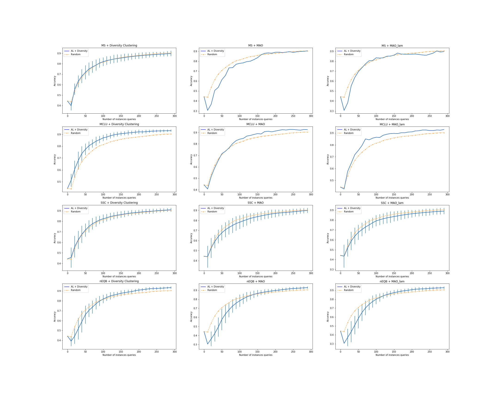

# Active Learning 

A comparison between different AL strategies.

Active Learning strategies:

- MS (margin sampling)
- MCLU (multi-class label uncertainty)
- SSC (significance space construction)
- nEQB (normalized entropy query bagging)

Diversity criteria: 
- MAO (most ambiguous and orthogonal)
- lambda
- diversity by clustering.

The dataset:

[Semeion Handwritten Digit Data Set](https://archive.ics.uci.edu/ml/datasets/Semeion+Handwritten+Digit)
